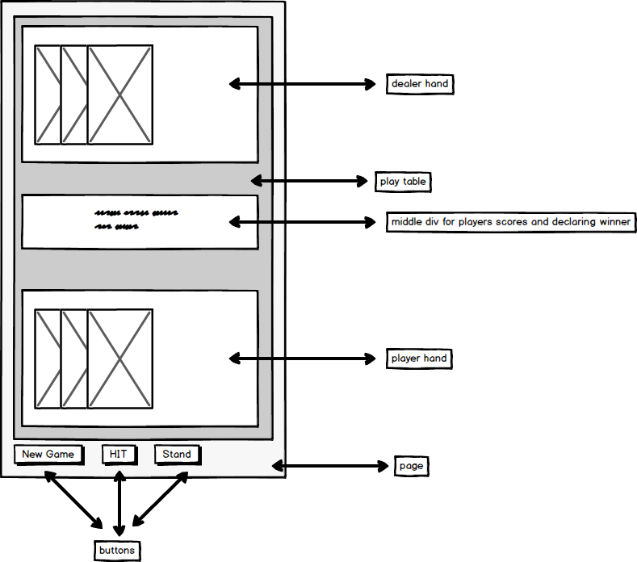

#Deployed:
[GitHub deployed page](https://philipfrazer.github.io/project-1/index.html)

#Trello:
[Trello Board](https://trello.com/b/qZnqPRUD/black-jack)

#Overview
I created a Black Jack card game based on a player versus dealer system. When the page loads 2 cards are auto dealt to both dealer and player hands. The current value of both the player and dealer's hands are displayed in the center of the board. After the initial deal the player has the option to either hit or stand via the 'Hit' and 'Stand' button on the bottom of the board. 'Hit' will add 1 card to players hand each time it is activated until player busts or decides to stand. 'Stand' will end the ability for player to hit, essentially ending the player's turn, at which point the game will calculate whether dealer will hit or stand. Once dealer has either 'Hit' or 'Stand' the game will calculate the winner. If at any point the player or dealer bust during the 'Hit' or 'Stand' phases the game will calculate and display the winner.    

#Technologies used:
HTML, JavaScript, CSS, JQuery.

#Wireframe

